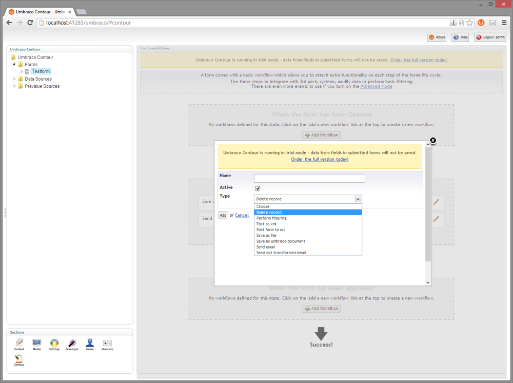
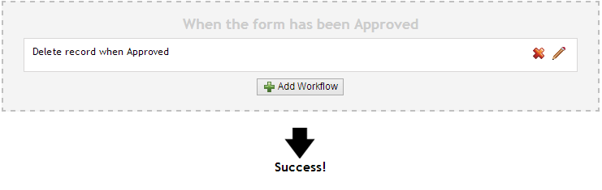

#Delete Workflow for Umbraco Contour

**This very simple Contour workflow deletes the current record from the database**

Compatible *only* with Umbraco Contour 3.0.15+

##How does it look?

It's a standard Contour workflow - nothing too fancy to expect visually:

##How to install and use?
Just drop the compiled assembly into /bin and you're set.

**Save to use ONLY when the form has been approved, not in submit state!**

 

##Download: Ready to use as an Umbraco Package
You can [download](http://our.umbraco.org//projects/backoffice-extensions/delete-workflow-for-umbraco-contour "Download the Package") "Delete Workflow for Umbraco Contour" as a ready to use Umbraco package and plug it into your site easily.

##Licence
Licensed under the [Apache License, Version 2.0](http://www.apache.org/licenses/LICENSE-2.0.html), which allows open source as well as commercial use.

##Author
Follow [esn303](https://twitter.com/esn303 "@esn303") on Twitter. Like [mindrevolution](https://www.facebook.com/mindrevolution) on Facebook. 

This project is open for collaboration. **Fork. Push. Innovate.**

